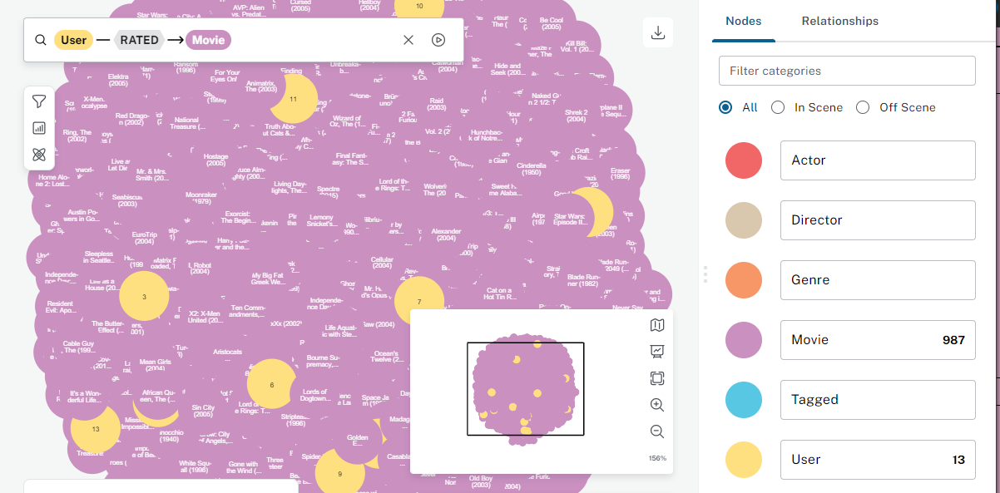
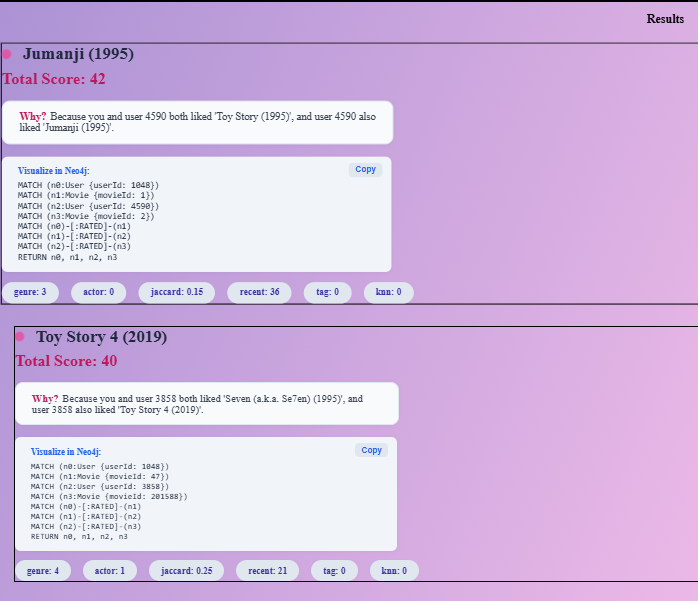

# Movie Recommendation System

A full-stack, explainable movie recommendation system using FastAPI, Neo4j, and React. It combines content-based and collaborative filtering to provide personalized movie recommendations, with transparent explanations for each suggestion.

---

## Table of Contents
- [Overview](#overview)
- [Screenshots & Explanations](#screenshots--explanations)
- [Architecture](#architecture)
- [Features & Philosophy](#features--philosophy)
- [Setup Instructions](#setup-instructions)
- [Usage](#usage)
- [Recommendation Logic](#recommendation-logic)
- [Data Model](#data-model)
- [Extending the Project](#extending-the-project)
- [Credits](#credits)

---

## Overview
This project recommends movies to users based on their past ratings, tags, and similarities to other users. It leverages a hybrid approach:
- **Content-based filtering** (genres, actors, tags, recency)
- **Collaborative filtering** (KNN, Jaccard similarity)
- **Explainability**: Each recommendation includes a human-readable explanation and a Cypher query for Neo4j visualization.

---

## Screenshots & Explanations

### 1. Neo4j Graph Visualization

*Visualizing the movie graph in Neo4j Browser. Each node represents a Movie, User, Actor, Director, Genre, or Tag. Relationships such as RATED, ACTED_IN, and IN_GENRE connect the entities, enabling rich graph-based recommendations.*

### 2. Web App Recommendation Results

*The frontend displays personalized movie recommendations for a user. Each result shows the movie title, total and component scores, a human-friendly explanation of why it was recommended, and a Cypher query to visualize the recommendation path in Neo4j. Users can easily copy the Cypher query for further exploration.*

---

## Architecture

### Backend
- **Framework**: FastAPI (Python)
- **Database**: Neo4j (graph database)
- **Scoring Modules**: Each module computes a score for candidate movies:
  - Genre similarity
  - Actor overlap
  - Tag overlap
  - Recency (recently popular movies)
  - Jaccard similarity (traits overlap)
  - KNN collaborative filtering (user-user similarity)
- **API Endpoint**: `/recommend` returns a ranked list of recommendations with explanations.

### Frontend
- **Framework**: React (Vite, Tailwind CSS)
- **Features**:
  - User inputs: User ID, recency window, result limit
  - Displays recommendations, scores, explanations, and Cypher queries
  - Modern, responsive UI

### Data Pipeline
- **CSV Data**: MovieLens links, movies, ratings, tags
- **Cypher Scripts**: For schema creation and data import
- **OMDB Enrichment**: Python script fetches actors, directors, genres from OMDB and generates Cypher for Neo4j
- **Loader Script**: Python script to run all import queries into Neo4j

---

## Features & Philosophy

This project is designed to be a flexible, high-performance, and explainable movie recommendation engine built atop Neo4j. Inspired by best practices in graph-based recommendation systems, it offers:

- **Clean and Modular Design**: Each recommendation strategy is implemented as a separate scoring module, making it easy to extend or customize.
- **High Performance**: Efficient Cypher queries and caching strategies ensure fast recommendations, even on large graphs.
- **Explainability**: Every recommendation comes with a human-readable explanation and a Cypher query, so users and developers can understand and visualize the reasoning behind each suggestion.
- **Hybrid Approach**: Combines content-based and collaborative filtering for improved accuracy and diversity.
- **Extensibility**: Easily add new data sources, scoring modules, or explanation logic to tailor the system to your needs.
- **A/B Testing Ready**: The modular scoring system allows for easy experimentation and comparison of different recommendation strategies.
- **Real-Time and Pre-Computed Recommendations**: While the system is optimized for real-time recommendations, it can be extended to support pre-computation for more complex scenarios.

This architecture and philosophy ensure that you can focus on the business logic and user experience, while the system handles the heavy lifting of graph traversal, scoring, and explainability.

---

## Setup Instructions

### Prerequisites
- Python 3.8+
- Node.js (v18+ recommended)
- Neo4j (local or Docker)

### 1. Clone the Repository
```sh
git clone <your-repo-url>
cd movie-recommendation
```

### 2. Backend Setup
```sh
cd backend
pip install fastapi uvicorn neo4j pydantic
```
- Edit `backend/db.py` if your Neo4j credentials differ.

### 3. Frontend Setup
```sh
cd ../frontend
npm install
```

### 4. Neo4j Database Setup
- Start Neo4j (default: `bolt://localhost:7687`, user: `your username`, pass: `your password`)
- Open Neo4j Browser at http://localhost:7474

### 5. Import Data
- Place MovieLens CSVs in the `data/` directory.
- Run the loader script:
```sh
python scripts/neo4j_loader.py
```
- (Optional) Enrich with OMDB:
  - Set your OMDB API key in `scripts/enrich_with_omdb.py`
  - Run the script to generate `import_queries/enrich_with_omdb.cypher`
  - Run the generated Cypher in Neo4j Browser or via a script

### 6. Run the Backend
```sh
cd backend
uvicorn main:app --reload
```

### 7. Run the Frontend
```sh
cd frontend
npm run dev
```
- Visit http://localhost:5173

---

## Usage
- Enter your User ID (from MovieLens data)
- (Optional) Set a recency window (in years) to prioritize recent movies
- Set the number of recommendations (limit)
- Click "Get Recommendations"
- View:
  - Movie title
  - Total and component scores
  - Human-friendly explanation (why this movie?)
  - Cypher query to visualize the recommendation path in Neo4j

---

## Recommendation Logic

### Scoring Modules
- **Genre Score**: Overlap of genres between user’s watched movies and candidate
- **Actor Score**: Shared actors between user’s watched movies and candidate
- **Tag Score**: Overlap of user’s tags with candidate
- **Recency Score**: Popularity of candidate among all users in recent years
- **Jaccard Score**: Jaccard similarity of traits (genres, actors, directors) between user’s watched movies and candidate
- **KNN Score**: Collaborative filtering using user-user similarity (Pearson correlation)

### Score Combination
- Each module returns a score; scores are weighted and summed (see `backend/utils.py:combine_scores`)
- The dominant factor is used for explanation and path tracing

### Explainability
- Each recommendation includes:
  - Path trace (graph path from user to movie)
  - Human-readable explanation (frontend logic)
  - Cypher query to visualize the path in Neo4j

---

## Data Model

### Nodes
- `User` (userId)
- `Movie` (movieId, imdbId, tmdbId, title, genres)
- `Genre` (name)
- `Actor` (name)
- `Director` (name)

### Relationships
- `(:User)-[:RATED]->(:Movie)` (with rating, timestamp)
- `(:User)-[:TAGGED {tag, timestamp}]->(:Movie)`
- `(:Movie)-[:IN_GENRE]->(:Genre)`
- `(:Actor)-[:ACTED_IN]->(:Movie)`
- `(:Director)-[:DIRECTED]->(:Movie)`

### Schema Constraints & Indexes
- See `import_queries/create_schema.cypher`

---

## Extending the Project
- Add new scoring modules in `backend/scoring/`
- Update `backend/main.py` and `utils.py` to include new scores
- Add new data sources by writing import scripts and Cypher queries
- Customize frontend explanations in `frontend/src/App.jsx`

---

## Credits
- MovieLens dataset (https://grouplens.org/datasets/movielens/)
- OMDB API (https://www.omdbapi.com/)
- Built with FastAPI, Neo4j, React, Vite, Tailwind CSS
 